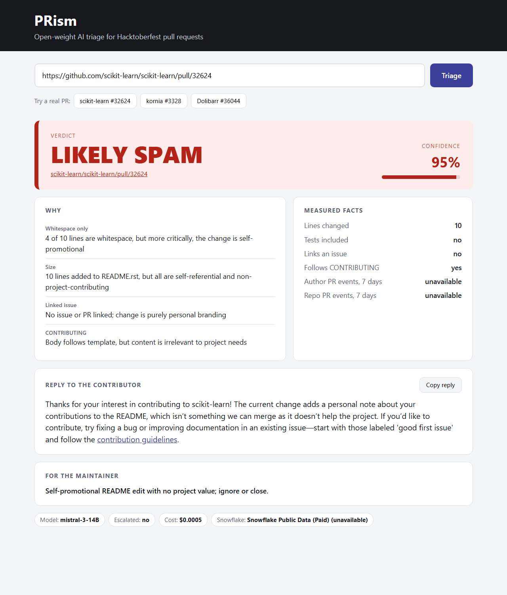
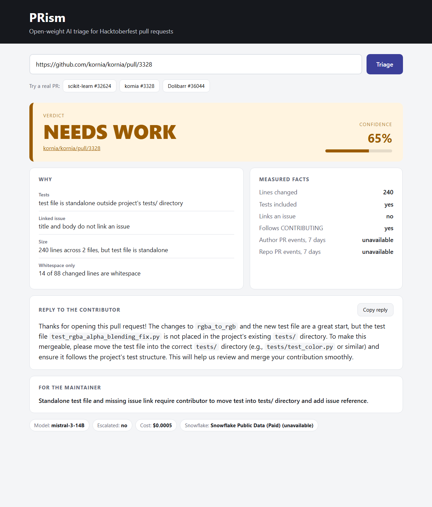
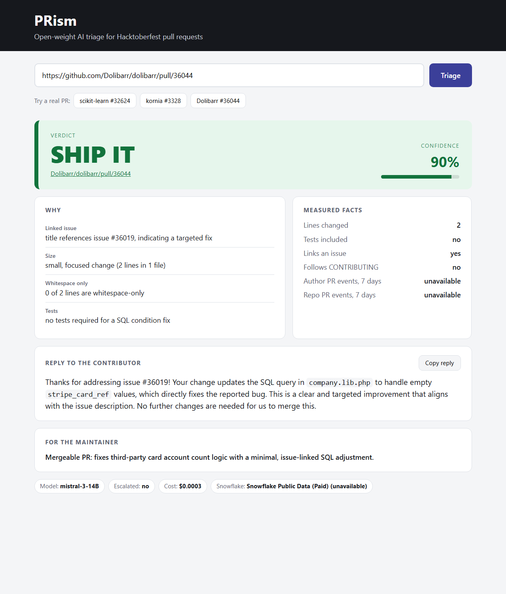
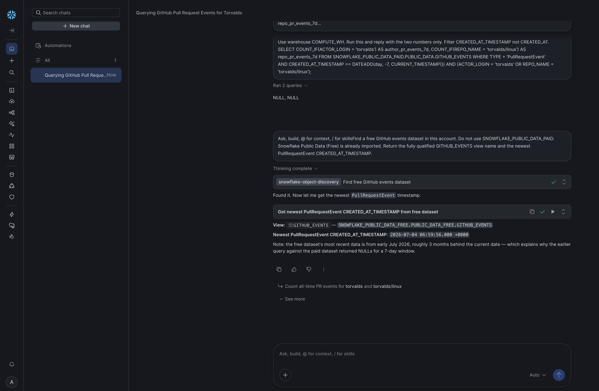

# PRism

**Open-source AI that protects open source.** PRism reads a GitHub pull request and tells the maintainer, in seconds, whether to ship it, ask for changes, or close it as spam, with the evidence behind the call and a kind reply ready for the contributor.



## The problem

Every October, Hacktoberfest brings maintainers a flood of pull requests. Many are spam: a name added to a README, a renamed file, a description that claims work the diff doesn't contain. Real first-timers get buried in the same queue, and a rushed maintainer can easily turn a well-meant but flawed beginner PR into a bad first experience.

PRism handles the first pass. It flags the noise, explains why, and writes a reply that tells a genuine contributor exactly what to fix.

| Likely spam | Needs work | Ship it |
| --- | --- | --- |
|  |  |  |

## How it works

```text
GitHub PR URL
  → prism/ingest.py     fetch the PR, its files, and patches from the GitHub REST API
  → prism/signals.py    measure the diff in plain Python: whitespace-only, size, tests,
                        linked issue, CONTRIBUTING
  → prism/context.py    query the author's and repo's recent public PR activity in Snowflake
  → prism/judge.py      open-weight model cascade on DigitalOcean returns a validated verdict
  → prism/api.py        FastAPI serves POST /triage and the web page
  → web/                verdict, evidence, measured facts, contributor reply
  → skill/prism-triage  the same pipeline packaged as an Agent Skill
```

The model never judges alone. Code measures the diff first, Snowflake adds public history, and the model is told to trust those facts over its own reading.

## Open-weight models

Every verdict comes from an open-weight model. No proprietary model is called anywhere in the pipeline.

| Role | Model | Publisher | Parameters | Price per 1M tokens (input / output) |
| --- | --- | --- | --- | --- |
| Small judge, runs on every PR | `mistral-3-14B` (Ministral 3 14B Instruct) | Mistral AI | 14B | $0.20 / $0.20 |
| Escalation judge, runs only when needed | `llama-4-maverick` (Llama 4 Maverick 17B 128E Instruct) | Meta | about 400B total | $0.25 / $0.87 |

Both run on DigitalOcean serverless inference at `https://inference.do-ai.run/v1` through its OpenAI-compatible chat completions endpoint. Model ids and prices are set in `.env`, so any other open-weight model on that endpoint can be swapped in.

## How the judge works

`prism/judge.py` is an original harness around those two models:

1. **Measured facts first.** The model receives the PR title, body, a capped excerpt of the diff, the deterministic signals computed in `prism/signals.py`, and the author's recent public pull-request activity from Snowflake. The system prompt in `skill/prism-triage/references/rubric.md` tells it to trust those measurements over its own reading of the diff.
2. **Strict JSON with repair.** The model must return a verdict (`ship_it`, `needs_work`, or `likely_spam`), a confidence, evidence lines, a reply to the contributor, and a summary for the maintainer. Output is validated against a Pydantic schema. Invalid output is sent back with the validation error, up to two repairs.
3. **Cascade.** The small model answers first. The large model runs only when the small model is unsure or contradicts the measurements:
   - confidence below 0.6
   - verdict `ship_it` on a whitespace-only diff
   - verdict `ship_it` from an author with 10 or more PR events in 7 days on a diff of 5 lines or fewer

   An escalation can only make a verdict stricter. If the large model would move an unsure verdict toward `ship_it`, PRism keeps the stricter verdict and notes the disagreement in the maintainer summary, so no PR is waved through on a second opinion alone. Each model call times out after 45 seconds, and a failed escalation falls back to the small model's verdict.
4. **Cost and provenance.** Every response records which model produced the verdict, whether it escalated, and the dollar cost computed from token usage.

The contributor reply is written to be kind and specific. It names the file or missing piece, says what a mergeable version would contain, and never calls the author a spammer.

## Evaluation

`eval/labeled.csv` holds 15 real public pull requests from Hacktoberfest-era repositories: 5 `likely_spam`, 5 `needs_work`, and 5 `ship_it`. Labels follow the maintainers' own outcome where one exists: a `spam` or `invalid` label, a changes-requested review, or a merge. Each row has a note explaining the label.

```powershell
.\.venv\Scripts\python.exe eval\run_eval.py
```

The script scores small-only against the cascade and prints accuracy, mean cost per PR, and how many PRs escalated.

| Mode | Accuracy | Mean cost per PR | Escalated |
| --- | --- | --- | --- |
| Small model only | 10/15 | $0.0005 | 0 |
| Cascade | 10/15 | $0.0005 | 0 |

Re-run on 2026-10-02 with live Snowflake author activity (`source=snowflake` on all 15 rows). On this pass the model was stricter on borderline `ship_it` cases (including the Dolibarr backup demo), so accuracy is below an earlier 13/15 run that used cached or unavailable Snowflake counts. Cascade did not escalate: every small-model confidence stayed at or above 0.6, and no `ship_it` contradicted the measured signals. Both modes still beat the earlier "large model always wins" cascade at **11/15**, which is why escalation remains stricter-only.

Misses on this run: one `needs_work` PR scored `likely_spam`, and four small/issue-linked fixes scored `needs_work` instead of `ship_it`. The hard home-assistant case that previously missed as `needs_work` is now correctly `likely_spam`.

An earlier version let the large model's verdict win outright. It scored 11/15, because Llama 4 Maverick tended to trust a PR's own description. That result is why escalation can now only make verdicts stricter. Qwen 3.5 397B was also tried as the escalation model and timed out on this endpoint.

## Snowflake

PRism uses Snowflake for the one thing a single PR can't show: what the author and the repo have been doing across public GitHub.

- **Dataset:** the free public GitHub events view `SNOWFLAKE_PUBLIC_DATA_FREE.PUBLIC_DATA_FREE.GITHUB_EVENTS`, using `TYPE`, `ACTOR_LOGIN`, `REPO_NAME`, and `CREATED_AT_TIMESTAMP`.

CoCo located that view in this account. The newest `PullRequestEvent` timestamp it returned is 2026-07-04.


- **Query:** `queries/github_context.sql` counts `PullRequestEvent` rows for the author and for the repo. The free listing lags about three months, so the 7-day window ends at the newest matching event in that view, not at the current time. Author and repo are bound as parameters, never formatted into the SQL.
- **How it's used:** the author's count becomes the `author_pr_events_7d` fact. An author opening 10 or more PRs a week on a tiny diff is one of the cascade's escalation triggers.
- **Fallback:** each result is cached under `fixtures/`, so the demo runs when Snowflake is unreachable. The page shows whether a result came live (`snowflake`), from the cache (`cache`), or not at all (`unavailable`).

## Agent skill

`skill/prism-triage/` follows the Agent Skills open standard: `SKILL.md` with `name` and `description` frontmatter, a `scripts/` folder, and a `references/` folder holding the rubric. Any agent that supports skills can triage a PR with:

```powershell
python skill/prism-triage/scripts/triage.py https://github.com/owner/repo/pull/123
```

## Run it

Requires Python 3.11 or newer, a DigitalOcean model access key, and (for live demos) a GitHub token plus Snowflake trial credentials from the organizers.

### Install

```powershell
py -3.11 -m venv .venv
.\.venv\Scripts\python.exe -m pip install -r requirements.txt
copy .env.example .env
```

### `.env` keys

| Key | Required for | What it is |
| --- | --- | --- |
| `MODEL_ACCESS_KEY` | always | DigitalOcean Gradient serverless inference key |
| `SMALL_MODEL` | always | Open-weight id, e.g. `mistral-3-14B` |
| `LARGE_MODEL` | always | Open-weight id, e.g. `llama-4-maverick` |
| `SMALL_INPUT_PER_MILLION` / `SMALL_OUTPUT_PER_MILLION` | cost chips | Dollars per million tokens for the small model |
| `LARGE_INPUT_PER_MILLION` / `LARGE_OUTPUT_PER_MILLION` | cost chips | Dollars per million tokens for the large model |
| `GITHUB_TOKEN` | live GitHub fetch | Classic token with read access to public repos |
| `SNOWFLAKE_ACCOUNT` / `SNOWFLAKE_USER` / `SNOWFLAKE_PASSWORD` | live Snowflake | Trial account from the organizers |
| `SNOWFLAKE_WAREHOUSE` / `SNOWFLAKE_DATABASE` / `SNOWFLAKE_SCHEMA` / `SNOWFLAKE_ROLE` | live Snowflake | Warehouse and role that can read `SNOWFLAKE_PUBLIC_DATA_FREE` |
| `PRISM_USE_CACHE` | optional | `1` = read PR payloads from `fixtures/` and skip GitHub |
| `SNOWFLAKE_DISABLED` | optional | `1` = skip the live query and use `fixtures/context_*.json` |

Leave proprietary model ids unused. Model ids and prices come from the DigitalOcean model page; copy them into `.env` rather than hard-coding them.

### Start the server

```powershell
.\.venv\Scripts\python.exe -m uvicorn prism.api:app --port 8000
```

Open `http://127.0.0.1:8000`. Link straight to a verdict with `http://127.0.0.1:8000/?pr=<pull request URL>`.

### Cache switches

| Goal | Settings |
| --- | --- |
| Full live path (GitHub + Snowflake + models) | `PRISM_USE_CACHE=0`, `SNOWFLAKE_DISABLED=0` |
| Fast demo / offline GitHub, live Snowflake | `PRISM_USE_CACHE=1`, `SNOWFLAKE_DISABLED=0` |
| Fully offline except the model | `PRISM_USE_CACHE=1`, `SNOWFLAKE_DISABLED=1` |

With both cache switches on, the 15 labeled PRs in `fixtures/` run without network calls to GitHub or Snowflake. A DigitalOcean key is still required for the judge. The page chip shows whether Snowflake data came `snowflake`, `cache`, or `unavailable`.

### Score the labeled set

```powershell
$env:PRISM_USE_CACHE = "1"
$env:SNOWFLAKE_DISABLED = "0"
.\.venv\Scripts\python.exe eval\run_eval.py
```

That uses cached PR payloads and live author activity when Snowflake credentials are set.
## Limitations

- Public pull requests only.
- The judge reads at most 20 files and the first 500 characters of each patch.
- Author activity covers only the last 7 days of public GitHub events.
- The evaluation set is 15 PRs. It's a sanity check for a hackathon, not a benchmark.
- The model can still be wrong. PRism is a first pass for the maintainer, not an auto-closer.

## Team

| Path | Owner | Job |
| --- | --- | --- |
| `prism/contract.py` | Shared | JSON shape. Change it together. |
| `prism/ingest.py` | Diveet | GitHub fetch |
| `prism/signals.py` | Diveet | Deterministic checks |
| `prism/context.py` | Diveet | Snowflake query |
| `queries/github_context.sql` | Diveet | SQL from CoCo |
| `prism/judge.py` | Manthan | Prompts, cascade, cost |
| `skill/prism-triage/references/rubric.md` | Manthan | System prompt |
| `eval/run_eval.py` | Manthan | Accuracy and cost |
| `prism/api.py` | Rohith | FastAPI wiring |
| `skill/prism-triage/` | Rohith | Agent skill |
| `web/` | Rohith | Verdict screen |
| `eval/labeled.csv` | Manthan | 15 labeled PR URLs |

## License

MIT. See `LICENSE`.
